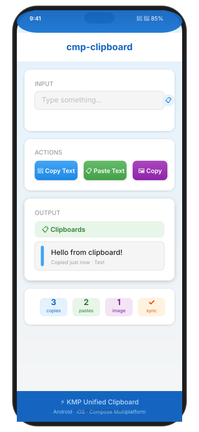

# cmp-clipboard



*Compose MultiPlatform clipboard library for Kotlin — unified clipboard API for Android and iOS.*

## Features

- **Unified API** — single `ClipboardManager` interface works on both platforms
- **Text clipboard** — `readText()` / `writeText(text)` for plain text
- **Image clipboard** — `readImage()` / `writeImage(image)` (returns `null` on platforms without image clipboard support)
- **Composable** — `rememberClipboardManager()` hook for Compose Multiplatform UI

## Installation

**settings.gradle.kts:**
```kotlin
dependencyResolutionManagement {
    repositories {
        google()
        mavenCentral()
    }
}
```

**build.gradle.kts (shared module):**
```kotlin
dependencies {
    implementation("io.github.govindtank:cmp-clipboard:0.1.0")
}
```

## Usage

```kotlin
import io.github.govindtank.clipboard.rememberClipboardManager

@Composable
fun App() {
    val clipboard = rememberClipboardManager()
    
    // Copy
    Button(onClick = { clipboard.writeText("Hello!") }) {
        Text("Copy")
    }
    
    // Paste  
    val text = clipboard.readText() ?: "(empty)"
    Text("Pasted: $text")
}
```

## API Reference

### `rememberClipboardManager()`
```kotlin
@Composable
fun rememberClipboardManager(): ClipboardManager
```
Composable that creates and remembers a `ClipboardManager` instance scoped to the composition lifecycle.

### `ClipboardManager` methods

| Method | Returns | Description |
|--------|---------|-------------|
| `readText()` | `String?` | Read plain text from system clipboard. Returns `null` when clipboard is empty or contains non-text data. |
| `writeText(text: String)` | `Unit` | Write plain text to system clipboard. Replaces any previous content. |
| `readImage()` | `ImageBitmap?` | Read an image from system clipboard. Returns `null` when no image available or platform lacks image clipboard support. |
| `writeImage(image: ImageBitmap)` | `Unit` | Write an image bitmap to system clipboard. |

### Platform expect functions

```kotlin
expect fun clipboardInit(context: Any? = null)
expect fun clipboardReadText(): String?
expect fun clipboardWriteText(text: String)
expect fun clipboardReadImage(): ImageBitmap?
expect fun clipboardWriteImage(image: ImageBitmap)
```

## Platform Notes

### Android

Requires `clipboardInit(context)` before first clipboard use. Call it once in a `LaunchedEffect` or `DisposableEffect`:

```kotlin
val context = LocalContext.current
val clipboard = rememberClipboardManager()

LaunchedEffect(Unit) {
    clipboardInit(context)
}
```

`context` should be the Android `Context` (typically from `LocalContext.current`). No extra permissions needed for clipboard access on Android.

### iOS

No initialization needed. `clipboardInit()` is a no-op on iOS. The library uses `UIPasteboard.general` directly — no entitlements or capabilities required.

## Requirements

- Kotlin 2.0.0+
- Compose Multiplatform 1.6.10+
- Android `minSdk` 21+
- iOS 12+

## License

MIT
